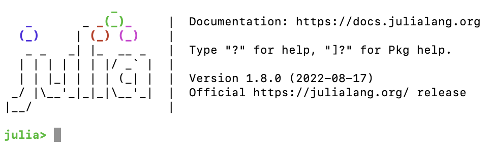

This package models the dynamics of a biofilm using the Julia programming language.  
```@contents
```

# Installation 

## Install Julia

- Download Julia from [julialang.org](https://julialang.org/downloads/)
- Install Julia following the provided directions
- Launch Julia and you should see a terminal like the following (version number may be different)


## Biofilm.jl


# Examples

## Case 1 - Single Substrate and Particulate Case

### Running the case
Start Julia in the Biofilm.jl directory
```
julia> include("examples/Case1.jl")
```

