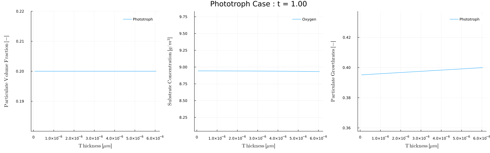

```@contents
Pages = ["postprocessing.md"]
```
---
# Postprocessing
When a simulation completes the solver outputs solution data that can be postprocessed to see additional values and/or plots. 

## Using the simulation outputs

When a simulation is executed using `t,zm,Xt,St,Pb,Sb,Lf,sol = BiofilmSolver(p)`, which is a line of code within each of the Case files solver will produce all the outputs described below
- `t` - array of the solution times
- `zm` - array of the biofilm grid locations at the end of the simulation `t[end]`
- `Xt=Xt(t)` - array of the particulate concentrations within the tank as a function of time
- `St=St(t)` - array of the substrate concentrations within the tank as a function of time
- `Pb=Pb(z)` - array of the particulate volume fractions within the biofilm as a function of location within biofilm at the end of the simulation
- `Sb=Sb(z)` - array of the substrate concentrations within the biofilm as a function of location within biofilm at the end of the simulation
- `Lf=Lf(t)` - array of the biofilm thickness as a function of time
- `sol` - entire solution from the ODE solver - contains the time history of all the variables.  This variable is difficult to parse but is used by the functions described below.

The output can be analyzed using Julia commands.  For example, after running Case1.jl (see [Run Biofilm.jl](@ref)), the maximum substrate concentration could be found 
```julia-repl
julia> maximum(S)
65.37595010026911
```

## analyzeBiofilm() - Query Simulation at Specified Times

The `analyzeBiofilm(sol,p,t)` function provides a simple way to postprocess data.  This function takes in the computed solution `sol` and parameters `p` and analyzes the results and the specified time or times `t`.  For example, after running Case1.jl (see [Run Biofilm.jl](@ref)) you could look at the solution at `t=0.25` days using
```julia-repl
julia> analyzeBiofilm(sol,p,0.25)
Analyzing Single Substrate and Particulate Case
   Time   |      Bug |   Oxygen | min,max(     Bug) | min,max(  Oxygen) |  Lf [μm] 
    0.250 |      102 |     51.7 |     0.08,    0.08 |     29.1,    51.3 |      545
```
which displays the tank and biofilm particulates and substrates and biofilm thickness at the requested time.  Multiple times can be included in the time parameter.  For example to get the values at t=0, 0.25, 0.5, 0.75, 1.0 we can run
```julia-repl
julia> analyzeBiofilm(sol,p,0:0.25:1)
Analyzing Single Substrate and Particulate Case
   Time   |      Bug |   Oxygen | min,max(     Bug) | min,max(  Oxygen) |  Lf [μm] 
    0.000 |       10 |       10 |     0.08,    0.08 |        0,       0 |       10
    0.250 |      102 |     51.7 |     0.08,    0.08 |     29.1,    51.3 |      545
    0.500 |      256 |     2.94 |     0.08,    0.08 |    0.568,    2.87 |      348
    0.750 |      257 |     2.93 |     0.08,    0.08 |    0.745,    2.87 |      312
    1.000 |      257 |     2.93 |     0.08,    0.08 |    0.761,    2.87 |      309
```

Adding an optional argument `makePlot=true`, i.e., `analyzeBiofilm(sol,p,0.25,makePlot=true)` will produce a plot of the biofilm quantities at the specified time(s)
```julia-repl
julia> analyzeBiofilm(sol,p,0.25,makePlot=true)
Analyzing Single Substrate and Particulate Case
   Time   |      Bug |   Oxygen | min,max(     Bug) | min,max(  Oxygen) |  Lf [μm] 
    0.250 |      102 |     51.7 |     0.08,    0.08 |     29.1,    51.3 |      545
```


```@docs
analyzeBiofilm
```

## movieBiofilm() - Make movie of biofilm quantities

The particulate and substrate concentrations change throughout the simulation, and it is often useful to make movies of how these change over time.  

The `movieBiofilm(times)` function provides a convenient way to make these movies. For example, to post process [Case 5 - Phototroph](#ref), which has a light that turns on and off throughout each day we could make a movie of the biofilm conditions during the day and during night.  To make a movie of every 5 days when the light is on, that is at times=1,5,10,... we can use
```julia-repl
julia> movieBiofilm(sol,p,1:5:t[end],filename="phototroph_day.gif",fps=5)
```
which will analyze each day and combine the results into the movie:


To produce the results every 5th night, that is at times=0.5, 5.5, ... we can use
```julia-repl
julia> movieBiofilm(sol,p,0.5:5:t[end],filename="phototroph_night.gif",fps=5)
```


Note that during the day the growth rate is zero and the oxygen concentration is 8.6, which is the inflow concentration `Sin`.  During the day however, the phototroph growth rate is non-zero, and the growth produces oxygen. 

```@docs
movieBiofilm
```